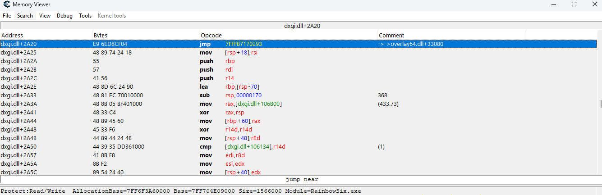
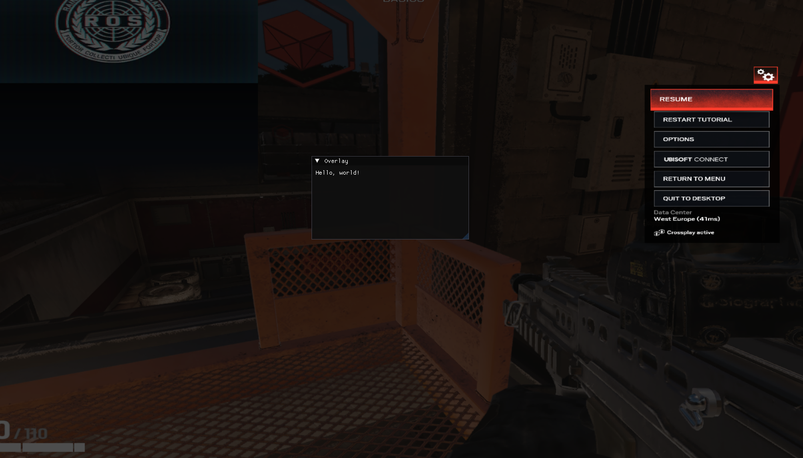

# Intro
So for many years people have been hooking direct x by overlays provided by 3rd party companys to avoid hookinf the native direct x. In this ill show u can obtain these dynamically rather then staticly revsering DiscordHook64.dll or overlay64.dll for there functions that may change update to update. 

(Note this will be focusing on dx12)

# Setup
in this tutorial I will be using a modifyed D3D12-Hook to fit my coding style as a base for my dx12 hook. For my hooking libary I rather differ from minhook and use safetyhook as it gives me more control over the stack and registers

D3D12-Hook
- https://github.com/DrNseven/D3D12-Hook-ImGui
Hooking libary
- https://github.com/cursey/safetyhook

# The Initial Idea for getting Present
Rather than coppy and pasting code ill show u the thought process.

## Understanding how overlays work

- DiscordHook64.dll - discords overlay
- overlay64.dll - Ubisoft's overlay

These are both ovelays that display infomation over the game process in order to do this they must intract with the game. SO HOW? they load [dynamic link library's](https://learn.microsoft.com/en-us/windows/win32/dlls/dynamic-link-libraries). This gives them the context to run in the games memory and intract with its rending system in order to render an fast overlay optimally.

Now in order for them to intercept the render q they hook the [Present function in dx12](https://learn.microsoft.com/en-us/windows/win32/api/dxgi/nf-dxgi-idxgiswapchain-present)
. This is achieved thru using [microsoft detours libary](https://github.com/microsoft/Detours) that internally uses inline hooks (aka trampoline hooks) meaning 

Example:
Let’s say the target function starts like this:
```c++
0x1000: mov eax, ecx
0x1002: add eax, 1
```
Detours will overwrite those bytes with a jump:
```c++
0x1000: jmp 0xDEADBEEF   ; jumps to your hook
0x1002: add eax, 1
```

To understand or reverse this, we need to decode the jump instruction. A typical jmp used by Detours looks like:
```c++
E9 <rel32>
```

- E9 is the opcode for a relative jump.
- <rel32> is a signed 4-byte offset from the next instruction.
- Total size = 5 bytes.

With this knowlage we can follow the jmp in c++
```c++
    // Skips the first byte (E9) to read the next 4 bytes.
    int32_t relOffset = *reinterpret_cast<int32_t*>(instructionAddress + 1);

    // calculate the absolute target address
    uintptr_t nextInstruction = reinterpret_cast<uintptr_t>(instructionAddress + 5);
    uintptr_t targetAddress = nextInstruction + relOffset;
```

This works because the jump offset is relative to the instruction after the jmp. By adding the offset to the address immediately following the instruction, you get the actual destination of the jump. This is the same way the cpu would do it.

# Putting the idea into action
Now by using kiero libary we can dynamically get the offset for dx12's Present already and log it out

```c++
//add this to d3d12hook.h
inline void* getMethodByIndex(uint16_t Index) {
	void* target = (void*)MethodsTable[Index];
	return target;
}

//[140] Present
void* _140 = getMethodByIndex(140);
printf("[140] Present: %p \n", _140);


//[54] Present
void* _54 = getMethodByIndex(54);
printf("[54] ExecuteCommandLists: %p \n", _54);
```

We should get somthing like this when we run the code
```c++
[-] _140: 00007FFFB2472A20
[-] _54: 00007FFEA08B6AC0
```
Open the addres of _140 in cheat engine and right click "disassemble this memory region" we should see the E9 as expected



We can see that cheat engine helpfully shows us what module this leads to being overlay64.dll . Now right click it and press follow 2 times and u end up in the overlay64.dll module this is the hook Ubisoft uses for an overlay.

The first jump u may of noticed u was taken to a padding regoin these use a diffrant calling convtion with the op code FF 25

That instruction format:

```c++
FF 25 xx xx xx xx   ; jmp qword ptr [rip+rel32]
```
- The 4-byte value after is a relative offset from the end of the instruction
- You must compute the target address by reading the memory address stored at [rip + offset]

```c++
uintptr_t resolveIndirectJmp(uintptr_t address) {
    uint32_t ripOffset = *reinterpret_cast<uint32_t*>(address + 2);
    uintptr_t rip = address + 6; // instruction is 6 bytes long
    uintptr_t targetPtr = rip + ripOffset;
    return *reinterpret_cast<uintptr_t*>(targetPtr); // dereference the pointer
}
```

Now we can make the functions to loop thru all the jump's and get an vaild one by checking that we dont go into a padding region.

```c++
uintptr_t resolveJump(uintptr_t address) {
    const int instructionSize = 5;

    int32_t relOffset = *reinterpret_cast<int32_t*>(address + 1);
    uintptr_t nextInstruction = address + instructionSize;
    return nextInstruction + relOffset;
}

bool isIndirectJmp(uintptr_t address) {
    // check for FF 25
    uint8_t* bytes = reinterpret_cast<uint8_t*>(address);
    return bytes[0] == 0xFF && bytes[1] == 0x25;
}

uintptr_t resolveIndirectJmp(uintptr_t address) {
    uint32_t ripOffset = *reinterpret_cast<uint32_t*>(address + 2);
    uintptr_t rip = address + 6; // instruction is 6 bytes long
    uintptr_t targetPtr = rip + ripOffset;
    return *reinterpret_cast<uintptr_t*>(targetPtr); // dereference the pointer
}

uintptr_t resolveJumpIfValid(uintptr_t address, int loop = 99) {
    uintptr_t currentAddress = address;
    uintptr_t prevValidTarget = address;

    while (loop-- > 0) {
        uint8_t* bytes = reinterpret_cast<uint8_t*>(currentAddress);
        uint8_t opcode = bytes[0];
        logger::print("[~] Current opcode: 0x%02X at 0x%p\n", opcode, (void*)currentAddress);

        uintptr_t targetAddress = 0x0;
        if (opcode == 0xE9) {
            targetAddress = resolveJump(currentAddress);
        }
        else if (bytes[0] == 0xFF && bytes[1] == 0x25) {
            targetAddress = resolveIndirectJmp(currentAddress);
        }
        else {
            break; // not a known jump
        }

        uintptr_t targetAddress = resolveJump(currentAddress);

        uint8_t targetOpcode = *reinterpret_cast<uint8_t*>(targetAddress);
        logger::print("[~] Target opcode: 0x%02X at 0x%p\n", targetOpcode, (void*)targetAddress);

        if (targetOpcode != 0x00)
            prevValidTarget = targetAddress;

        if (targetAddress == currentAddress) {
            logger::print("[~] JMP loops to itself at 0x%p\n", (void*)currentAddress);
            break;
        }

        logger::print("[~] Following JMP: 0x%p -> 0x%p\n", (void*)currentAddress, (void*)targetAddress);
        currentAddress = targetAddress;
    }

    logger::print("[~] Final resolved JMP: 0x%p\n", (void*)prevValidTarget);
    return prevValidTarget;
}
```

# Result

When combined with a basic hook on ExecuteCommandLists for now



Boom we have hooked Ubisofts overlay with 0 sig or offsets that could change and this will working with any other overlay. (Some overlays will be sigged by anticheats so look in ida pro for functions that the found overlay calles with a vaild SwapChain)

Now your wondering is there an better way to get the CommandQueue from the ExecuteCommandLists without such an easily dectable hook on ExecuteCommandLists?
